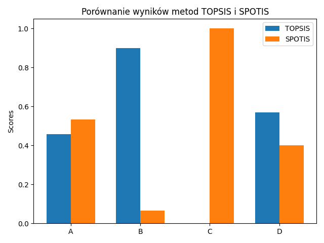

# Lab 4 – Wprowadzenie do biblioteki pymcdm

## 👤 Autor
**Tomasz Królikowski**  
**Nr albumu:** 153790  
**Repozytorium GIT:** [Link do repozytorium](https://github.com/krolikowski80/studia_WSB/tree/main/Python/intro/zad_4)

---

## 📌 Opis zadania
Celem ćwiczenia było zapoznanie się z biblioteką `pymcdm` i zastosowanie metod MCDM: **TOPSIS** oraz **SPOTIS** do oceny alternatyw.  
Wyniki zostały porównane, zaprezentowane graficznie i zapisane do plików.

---

## 📁 Struktura projektu

```
zad_4/
├── main.py                  # Główny plik analizujący dane metodami TOPSIS i SPOTIS
├── raport.md                # Raport z przeprowadzonej analizy
├── requirements.txt         # Lista zależności
├── README.md                # Niniejszy plik
└── wyniki/
    ├── wyniki_topsis_spotis.xlsx  # Zestawienie wyników TOPSIS i SPOTIS
    └── wykres.png                 # Wykres porównujący rankingi
```

---

## ▶️ Uruchomienie projektu

1. **Stwórz i aktywuj wirtualne środowisko (opcjonalnie):**
    ```bash
    python -m venv venv
    source venv/bin/activate  # lub venv\Scripts\activate na Windows
    ```

2. **Zainstaluj zależności:**
    ```bash
    pip install -r requirements.txt
    ```

3. **Uruchom analizę:**
    ```bash
    python main.py
    ```

4. **Wyniki znajdziesz w katalogu `wyniki/`**

---

## 🧪 Zastosowane biblioteki

- `pymcdm`
- `pandas`
- `numpy`
- `matplotlib`

---

## Wykres porównawczy

Poniżej przedstawiono wykres porównujący wyniki metod TOPSIS i SPOTIS:


