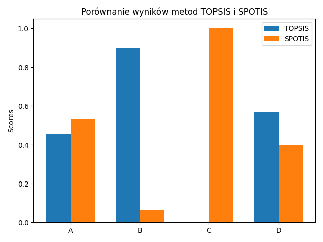

# Lab 4 – Wprowadzenie do biblioteki pymcdm

## 👤 Autor
### Tomasz Królikowski, numer albumu: 153790

### Zadanie znajduję się w repozytorium GIT pod adresem:  
### https://github.com/krolikowski80/studia_WSB/tree/main/Python/intro/zad_4

## 1. Cel zadania

Celem niniejszego laboratorium było zapoznanie się z biblioteką `pymcdm` oraz zastosowanie dwóch metod wielokryterialnego podejmowania decyzji: **TOPSIS** i **SPOTIS**. Porównano wyniki dla tego samego zestawu danych i przeanalizowano różnice między rankingami.

---

## Dane wejściowe

Macierz decyzyjna reprezentuje cztery alternatywy (Auta) oceniane według trzech kryteriów:
1. **Koszt** (PLN) – *minimalizowany*
2. **Ocena użytkownika** (skala 0–10) – *maksymalizowana*
3. **Ilość funkcji** – *maksymalizowana*

Wagi przypisane kryteriom: `[0.5, 0.3, 0.2]`  
Typy kryteriów: `[-1, 1, 1]`

Macierz decyzyjna:

| Auto | Koszt | Ocena | Funkcje |
|------|-------|--------|----------|
| A    | 25000 | 7.5    | 5        |
| B    | 22000 | 8.0    | 6        |
| C    | 27000 | 6.5    | 4        |
| D    | 24000 | 7.0    | 7        |

---

## Wyniki

Wyniki działania metod zapisano w pliku `wyniki/wyniki_topsis_spotis.xlsx`.

| Auto | TOPSIS Score | TOPSIS Ranking | SPOTIS Score | SPOTIS Ranking |
|------|--------------|----------------|--------------|----------------|
| A    | 0,458507423  | 3              | 0,533333333  | 3              |
| B    | 0,899721016  | 1              | 0,066666667  | 1              |
| C    | 0            | 4              | 1            | 4              |
| D    | 0,569499126  | 2              | 0,4          | 2              |

---

## Wykres porównawczy

Poniżej przedstawiono wykres porównujący wyniki metod TOPSIS i SPOTIS:

---

## Wnioski

- Obie metody wykazały zgodność w rankingu (B > D > A > C).
- Alternatywa **C** była zdominowana – użytkownik otrzymał stosowne ostrzeżenie z biblioteki `pymcdm`.
- **TOPSIS** i **SPOTIS** różnią się sposobem normalizacji i oceny, ale przy podobnych danych prowadzą do spójnych wyników.
- Plik `wykres.png` zawiera graficzne porównanie punktacji dla obu metod.

---

## Zastosowane biblioteki

- `pymcdm`
- `numpy`
- `pandas`
- `matplotlib`
