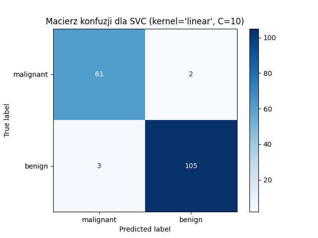
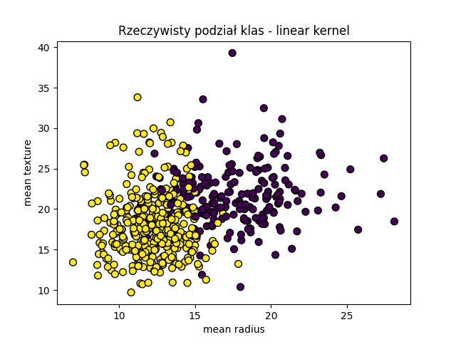
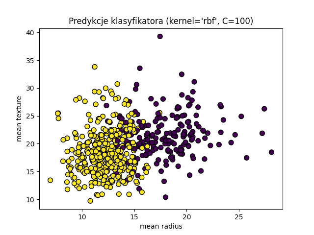

# Raport z Laboratorium 2

## Temat: Klasyfikacja danych breast_cancer przy użyciu SVC (Support Vector Classifier)

### 1. Cel zadania
Celem laboratorium było przeprowadzenie procesu klasyfikacji danych dotyczących raka piersi przy użyciu klasyfikatora SVC z biblioteki scikit-learn oraz analiza wpływu parametrów modelu (parametr C, typ jądra) na jakość klasyfikacji.

---

### 2. Zbior danych i wstępna eksploracja

Do eksperymentu wykorzystano wbudowany zbór danych `breast_cancer` z pakietu `sklearn.datasets`. Dane zawierają 569 próbek i 30 cech opisujących właściwości guzów.

- Liczba cech: **30**
- Liczba klas: **2** (malignant, benign)
- Liczba próbek: **569**

---

### 3. Podział danych
Dane zostały podzielone na:
- Zbiór uczący: **70%** (398 próbek)
- Zbiór testowy: **30%** (171 próbek)

Parametry podziału:
- `test_size=0.3`
- `random_state=42` (dla powtarzalności wyników)

---

### 4. Trenowanie klasyfikatora SVC

#### 4.1 Model domyślny
Wytrenowano klasyfikator SVC z domyślnymi parametrami (`C=1.0`, `kernel='rbf'`).

**Dokładność (accuracy)** na zbiorze testowym:
> **0.9357**

---

### 5. Dobór najlepszego parametru C i rodzaju jądra (kernel)

Dla jąder `linear` i `rbf` przetestowano wartości C: **0.1, 1, 10, 100**.

#### Wyniki dla `kernel='linear'`:
```
C=0.1 -> Accuracy: 0.9649
C=1   -> Accuracy: 0.9649
C=10  -> Accuracy: 0.9708 <-
C=100 -> Accuracy: 0.9474
```
**Wybrano: C=10** (accuracy: **0.9708**)

#### Wyniki dla `kernel='rbf'`:
```
C=0.1 -> Accuracy: 0.9123
C=1   -> Accuracy: 0.9357
C=10  -> Accuracy: 0.9415
C=100 -> Accuracy: 0.9883 <-
```
**Wybrano: C=100** (accuracy: **0.9883**)

---

### 6. Pełna ewaluacja modeli
Dla obu najlepszych modeli (`linear` z C=10, `rbf` z C=100) obliczono dodatkowe metryki:

| Kernel | Best C | Accuracy |
|--------|--------|----------|
| linear | 10     | 0.9708   |
| rbf    | 100    | 0.9883   |


**(Wszystkie dane zostały zapisane w pliku Excel: `rozszerzone_wyniki_klasyfikacji.xlsx`)**

---

### 7. Macierze konfuzji (Confusion Matrix)
Dla każdego modelu wygenerowano i zapisano macierz konfuzji.
<p align="center"> 
 
 
</p>

---

### 8. Wizualizacje podziału klas
Dla każdego klasyfikatora wykonano dwa wykresy:
1. **Rzeczywisty podział klas** (kolory wg etykiet `y`)
2. **Predykcja klasyfikatora** (kolory wg `model.predict(X)`)

Dane wizualizowane na wykresie: dwie pierwsze cechy (`mean radius`, `mean texture`).

<p align="center"> 
 
 
</p>
<p align="center"> 
 
 
</p>

---

### 9. Wnioski
- Dobór parametru C i jądra znacząco wpływa na skuteczność klasyfikatora.
- Jądro **`rbf` z C=100** osiągnęło najwyższą skuteczność (**0.9883**).
- Model `linear` jest nieco mniej skuteczny, ale nadal bardzo dobry (**0.9708**).
- Wizualizacje pokazały, że podział klas jest w większości poprawny, ale niewielka liczba błędów może się pojawić (FN/FP).

---

### 10. Załączniki do raportu:
- `lab2_svc_153790.py` – pełny kod programu
- `rozszerzone_wyniki_klasyfikacji.xlsx` – tabela metryk
- Pliki PNG: wykresy i macierze konfuzji
