# Raport: Analiza zbioru danych California Housing

## 1. Wprowadzenie

Celem tego zadania było zastosowanie regresji liniowej na rzeczywistych danych dotyczących cen nieruchomości w Kalifornii. Chciałem sprawdzić, jak dobrze model przewidywał medianę wartości domów na podstawie różnych cech, takich jak średni dochód mieszkańców, liczba pokoi czy wiek budynku.

## 2. Wczytanie i analiza zbioru danych

Dane pobrałem z biblioteki **scikit-learn** i zapisałem w formie **DataFrame**. Pierwsze wiersze zbioru wyglądały następująco:

| MedInc | HouseAge | AveRooms | AveBedrms | Population | AveOccup | Latitude | Longitude | MedHouseVal |
|--------|----------|----------|-----------|------------|----------|----------|-----------|-------------|
| 8.3252 | 41.0     | 6.984127 | 1.023810  | 322.0      | 2.555556 | 37.88    | -122.23   | 4.526       |
| 8.3014 | 21.0     | 6.238137 | 0.971880  | 2401.0     | 2.109842 | 37.86    | -122.22   | 3.585       |
| 7.2574 | 52.0     | 8.288136 | 1.073446  | 496.0      | 2.802260 | 37.85    | -122.24   | 3.521       |
| 5.6431 | 52.0     | 5.817352 | 1.073059  | 558.0      | 2.547945 | 37.85    | -122.25   | 3.413       |
| 3.8462 | 52.0     | 6.281853 | 1.081081  | 565.0      | 2.181467 | 37.85    | -122.25   | 3.422       |

Zbiór danych zawierał **20 640** rekordów oraz **8 cech**, które mogły wpływać na cenę domu. Zmienna docelowa to **MedHouseVal** – mediana wartości domów w danym rejonie.

## 3. Wizualizacja danych

Aby zobaczyć, jak poszczególne cechy wpływały na cenę domów, wygenerowałem wykresy punktowe dla każdej cechy. Na przykład:

  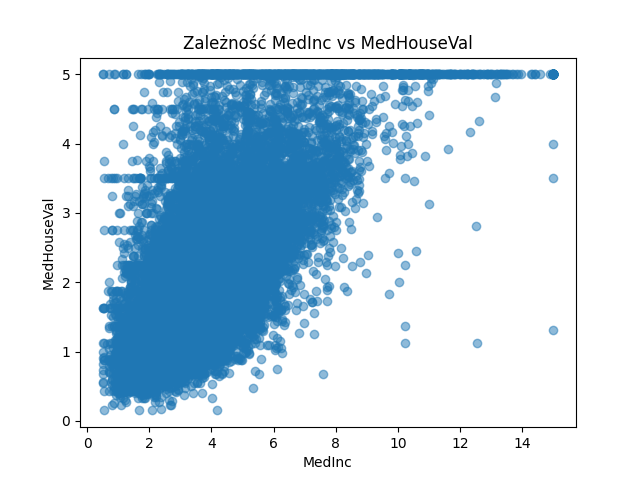
  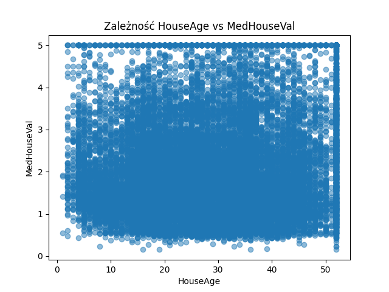
  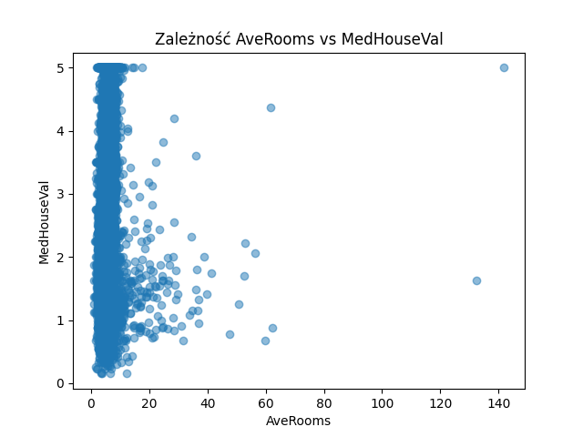

  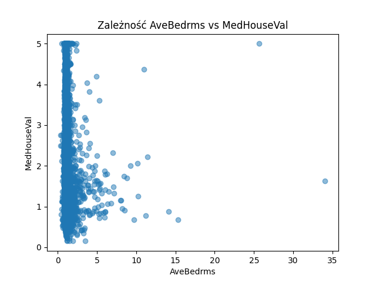
  
  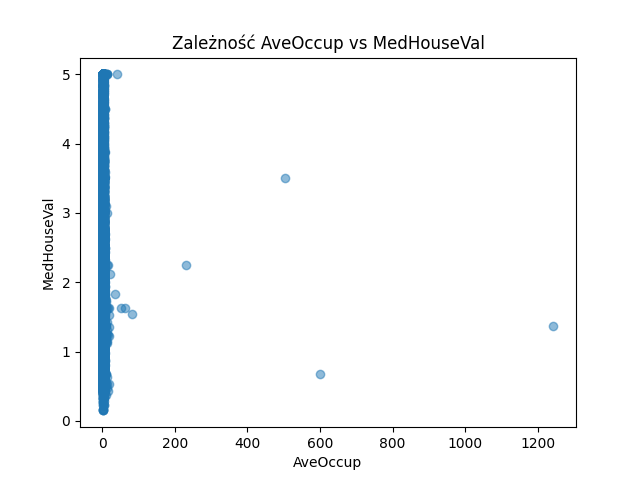

  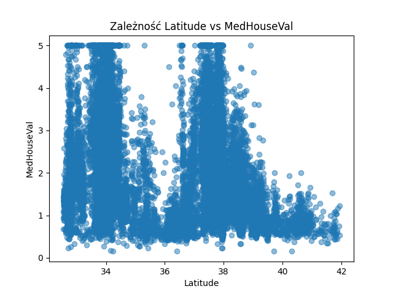
  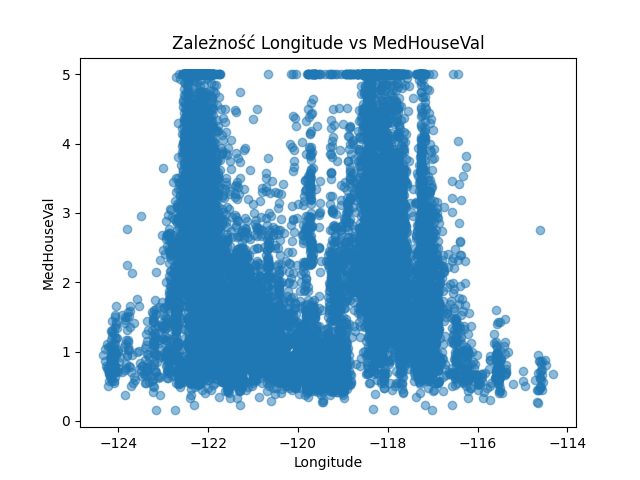

Z wykresów wynika, że **MedInc (medianowy dochód mieszkańców)** był silnie skorelowany z wartością domu – im wyższy dochód, tym droższe nieruchomości.

## 4. Podział na zbiór uczący i testowy

Dane podzieliłem w proporcji **70% na zbiór uczący** i **30% na zbiór testowy**.

Rozmiary zbiorów:

- **X\_train**: 14 448 próbek
- **X\_test**: 6 192 próbek

## 5. Trenowanie modelu regresji liniowej

Najpierw utworzyłem **model wielowymiarowy**, czyli taki, który uwzględniał wszystkie 8 cech jednocześnie. Model został nauczony na zbiorze uczącym i oceniony na zbiorze testowym. Wyniki błędów były następujące:

- **MAE (średni błąd bezwzględny) na zbiorze uczącym**: 0.530969
- **MSE (średni błąd kwadratowy) na zbiorze uczącym**: 0.523358
- **MAE na zbiorze testowym**: 0.527247
- **MSE na zbiorze testowym**: 0.530568

## 6. Regresja liniowa dla pojedynczych cech

Aby sprawdzić, czy pojedyncze cechy wystarczyły do przewidywania cen domów, wytrenowałem **8 osobnych modeli regresji** – każdy na jednej cesze. Proces wyglądał następująco:

- **i.** Dla każdej cechy wybierałem kolumnę z `X_train` oraz `X_test`, aby uzyskać jednowymiarowe macierze.
- **ii.** Trenowałem osobny model `LinearRegression` na wybranej cesze oraz `y_train`.
- **iii.** Tworzyłem wykresy regresji, na których zaznaczałem rzeczywiste wartości oraz linię regresji.
- **iv.** Obliczałem wartości MAE oraz MSE, aby sprawdzić skuteczność predykcji.

Dla każdej zmiennej wygenerowałem również wykresy regresji. Aby sprawdzić, czy pojedyncze cechy wystarczyły do przewidywania cen domów, wytrenowałem **8 osobnych modeli regresji** – każdy na jednej cesze.

Dla każdej zmiennej wygenerowałem również wykresy regresji.
### Wykresy regresji dla każdej cechy:

  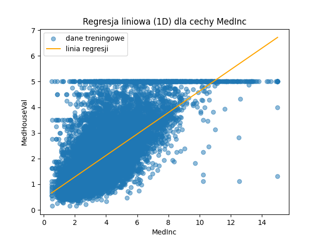
  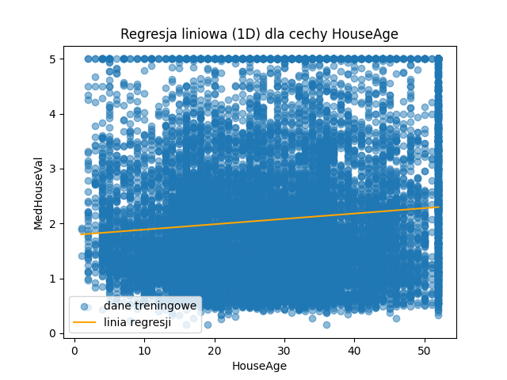
  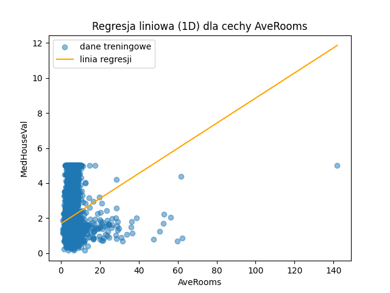

  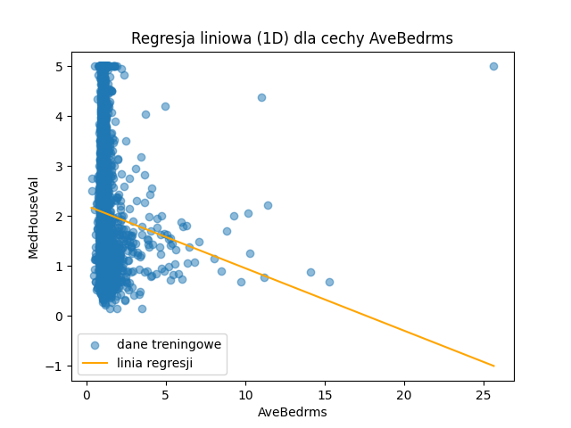
  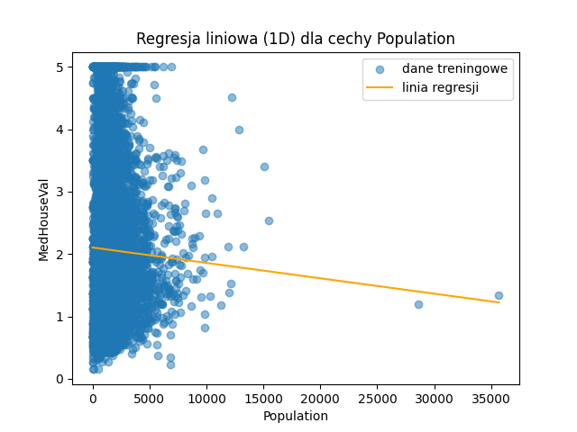
  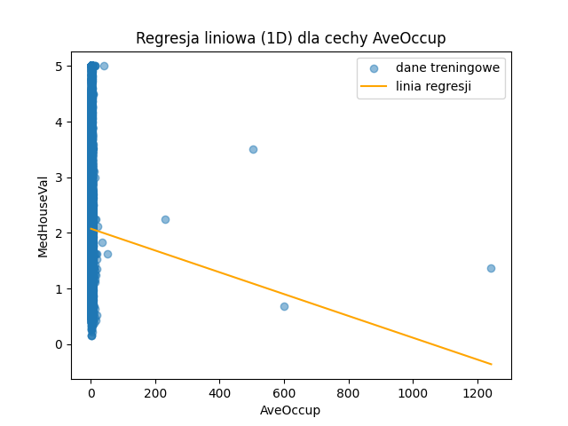

  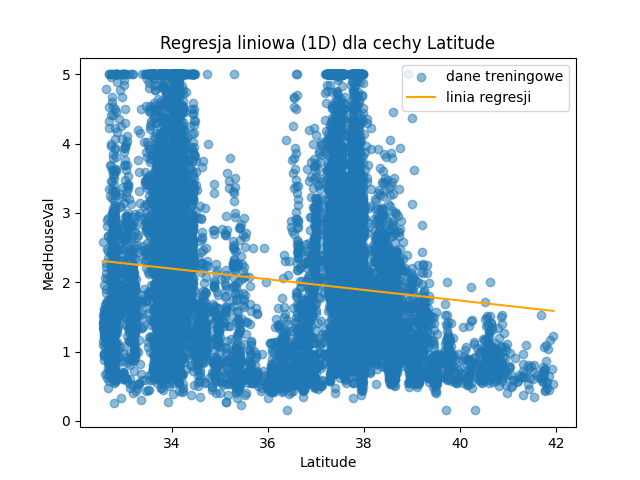
  

### Pełna tabela wyników dla wszystkich cech:

| Cecha          | MAE (train) | MSE (train) | MAE (test) | MSE (test) |
|---------------|------------|------------|------------|------------|
| Wielowymiarowy | 0.5310     | 0.5234     | 0.5272     | 0.5306     |
| MedInc        | 0.6270     | 0.7051     | 0.6232     | 0.6918     |
| HouseAge     | 0.9086     | 1.3245     | 0.9013     | 1.2985     |
| AveRooms     | 0.8993     | 1.3087     | 0.8883     | 1.2824     |
| AveBedrms    | 0.9121     | 1.3366     | 0.9048     | 1.3103     |
| Population   | 0.9141     | 1.3389     | 0.9061     | 1.3117     |
| AveOccup    | 0.9140     | 1.3391     | 0.9058     | 1.3116     |
| Latitude    | 0.9055     | 1.3129     | 0.8967     | 1.2830     |
| Longitude   | 0.9109     | 1.3364     | 0.9026     | 1.3108     |

## 7. Analiza wyników

Porównując wyniki:

- Model **wielowymiarowy** (ze wszystkimi cechami) osiągnął **mniejszy błąd** niż jakakolwiek pojedyncza cecha.
- Najlepszą pojedynczą cechą okazał się **MedInc** (medianowy dochód), który samodzielnie dawał całkiem dobre przewidywania.
- Pozostałe cechy, takie jak **HouseAge czy Population**, miały większe błędy, co oznacza, że samodzielnie nie były dobrymi predyktorami cen mieszkań.
- **Uczenie modelu na pojedynczych zmiennych prowadziło do większego błędu niż w przypadku modelu wielowymiarowego.** Oznacza to, że uwzględnienie wszystkich cech jednocześnie poprawia jakość predykcji.
  Porównując wyniki:
- Model **wielowymiarowy** (ze wszystkimi cechami) osiągnął **mniejszy błąd** niż jakakolwiek pojedyncza cecha.
- Najlepszą pojedynczą cechą okazał się **MedInc** (medianowy dochód), który samodzielnie dawał całkiem dobre przewidywania.
- Pozostałe cechy, takie jak **HouseAge czy Population**, miały większe błędy, co oznacza, że samodzielnie nie były dobrymi predyktorami cen mieszkań.

## 8. Podsumowanie

- Regresja liniowa działała najlepiej, gdy wykorzystywałem **wszystkie cechy jednocześnie**.
- Niektóre cechy (np. **MedInc**) były bardziej wartościowe niż inne, ale wciąż lepiej było używać kilku cech naraz.
- Błędy MAE i MSE pokazały, że model wielowymiarowy był **dokładniejszy niż modele jednowymiarowe**.
- Wszystkie etapy analizy zostały udokumentowane w postaci wykresów i tabel wyników, które znajdują się w katalogach `charts_all_features` oraz `charts_single_feature`.
- Regresja liniowa działała najlepiej, gdy wykorzystywałem **wszystkie cechy jednocześnie**.
- Niektóre cechy (np. **MedInc**) były bardziej wartościowe niż inne, ale wciąż lepiej było używać kilku cech naraz.
- Błędy MAE i MSE pokazały, że model wielowymiarowy był **dokładniejszy niż modele jednowymiarowe**.
