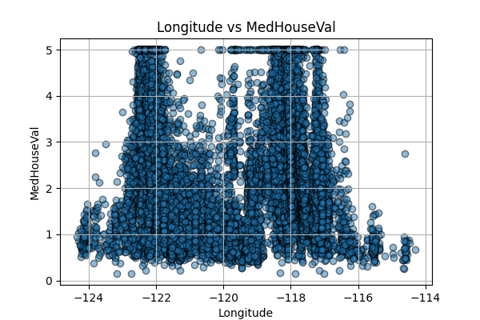
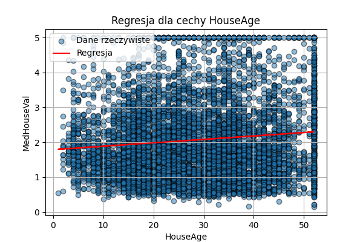

# Raport: Analiza zbioru danych California Housing

## 1. Wprowadzenie

Celem tego zadania było zastosowanie regresji liniowej na danych dotyczących cen nieruchomości w Kalifornii. Miałem sprawdzić, jak dobrze model przewidywał medianę wartości domów na podstawie różnych cech, takich jak średni dochód mieszkańców, liczba pokoi czy wiek budynku.

## 2. Wczytanie i analiza zbioru danych

Dane pobrałem z biblioteki **scikit-learn** i zapisałem w formie **DataFrame**. Pierwsze wiersze zbioru wyglądały następująco:

| MedInc | HouseAge | AveRooms | AveBedrms | Population | AveOccup | Latitude | Longitude | MedHouseVal |
|--------|----------|----------|-----------|------------|----------|----------|-----------|-------------|
| 8.3252 | 41.0     | 6.984127 | 1.023810  | 322.0      | 2.555556 | 37.88    | -122.23   | 4.526       |
| 8.3014 | 21.0     | 6.238137 | 0.971880  | 2401.0     | 2.109842 | 37.86    | -122.22   | 3.585       |
| 7.2574 | 52.0     | 8.288136 | 1.073446  | 496.0      | 2.802260 | 37.85    | -122.24   | 3.521       |
| 5.6431 | 52.0     | 5.817352 | 1.073059  | 558.0      | 2.547945 | 37.85    | -122.25   | 3.413       |
| 3.8462 | 52.0     | 6.281853 | 1.081081  | 565.0      | 2.181467 | 37.85    | -122.25   | 3.422       |

Zbiór danych zawierał **20 640** rekordów oraz **8 cech**, które mogły wpływać na cenę domu.

## 3. Wizualizacja danych

Aby zobaczyć, jak poszczególne cechy wpływały na cenę domów, wygenerowałem wykresy punktowe dla każdej cechy.

  
  
  

  
  
  

  
  

Z wykresów wynika, że **MedInc (medianowy dochód mieszkańców)** był silnie skorelowany z wartością domu – im wyższy dochód, tym droższe nieruchomości.

## 4. Podział na zbiór uczący i testowy

Dane podzieliłem w proporcji **70% na zbiór uczący** i **30% na zbiór testowy**.

Rozmiary zbiorów:

- **X\_train**: 14 448 próbek
- **X\_test**: 6 192 próbek

## 5. Trenowanie modelu regresji liniowej

Najpierw utworzyłem **model wielowymiarowy**, czyli taki, który uwzględniał wszystkie 8 cech jednocześnie. Model został nauczony na zbiorze uczącym i oceniony na zbiorze testowym. Wyniki błędów były następujące:

- **MAE (średni błąd bezwzględny) na zbiorze uczącym**: 0.530969
- **MSE (średni błąd kwadratowy) na zbiorze uczącym**: 0.523358
- **MAE na zbiorze testowym**: 0.527247
- **MSE na zbiorze testowym**: 0.530568

## 6. Regresja liniowa dla pojedynczych cech

  
  
  

  
  
  

  
  

## 7. Analiza wyników

Model wielowymiarowy osiągnął **mniejszy błąd** niż jakakolwiek pojedyncza cecha. Oznacza to, że uwzględnienie wszystkich cech jednocześnie poprawia jakość predykcji. Najlepszą pojedynczą cechą okazał się **MedInc** (medianowy dochód), który samodzielnie dawał całkiem dobre przewidywania.

## 8. Podsumowanie

- Regresja liniowa działała najlepiej, gdy wykorzystywałem **wszystkie cechy jednocześnie**.
- Niektóre cechy (np. **MedInc**) były bardziej wartościowe niż inne, ale wciąż lepiej było używać kilku cech naraz.
- Błędy MAE i MSE pokazały, że model wielowymiarowy był **dokładniejszy niż modele jednowymiarowe**.