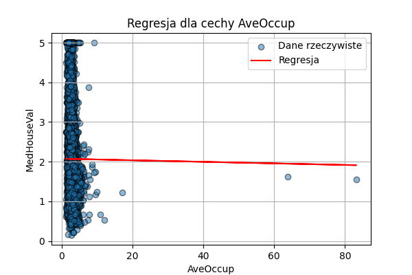
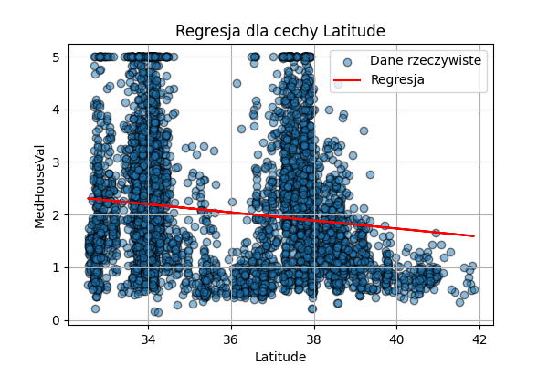

# Analiza zbioru danych California Housing

- Celem tego zadania było zastosowanie regresji liniowej na danych dotyczących cen nieruchomości w 
Kalifornii. Miałem sprawdzić, jak dobrze model przewidywał medianę wartości domów na podstawie różnych cech, takich jak średni dochód mieszkańców, liczba pokoi czy wiek budynku.

## (a) Wczytanie i analiza zbioru danych
Dane pobrałem z biblioteki **scikit-learn** i zapisałem w formie **DataFrame**.

```python
# Wczytanie danych
california = fetch_california_housing()
X = pd.DataFrame(california.data, columns=california.feature_names)
y = california.target
```
Kilka pierwszych wierszy zbioru danych:

| MedInc  | HouseAge | AveRooms  | AveBedrms | Population | AveOccup | Latitude | Longitude | MedHouseVal |
|---------|----------|-----------|-----------|------------|----------|----------|-----------|-------------|
| 8.3252  | 41       | 6.9841    | 1.0238    | 322        | 2.5556   | 37.88    | -122.23   | 4.526       |
| 8.3014  | 21       | 6.2381    | 0.9719    | 2401       | 2.1098   | 37.86    | -122.22   | 3.585       |
| 7.2574  | 52       | 8.2881    | 1.0734    | 496        | 2.8023   | 37.85    | -122.24   | 3.521       |
| 5.6431  | 52       | 5.8174    | 1.0731    | 558        | 2.5479   | 37.85    | -122.25   | 3.413       |
| 3.8462  | 52       | 6.2819    | 1.0811    | 565        | 2.1815   | 37.85    | -122.25   | 3.422       |


## (b). Wizualizacja danych
Aby zobaczyć wpływ poszczególnych cech na ceny domów, wygenerowałem wykresy zależności:

<p align="center">    </p> <p align="center">    </p> <p align="center">   </p>

## Trenowanie modelu regresji liniowej
### (c) Podział danych na zbiór uczący i testowy (70% / 30%)
Rozmiary zbiorów:
- X_train: 14 448 próbek
- X_test: 6 192 próbek
### (d) Nauka modelu regresji liniowej na zbiorze uczącym
### (e) Obliczanie błędów MAE i MSE dla zbiorów uczącego i testowego
Model regresji liniowej został nauczony na zbiorze uczącym. Wyniki błędów są następujące:

| Zbiór  | MAE (średni błąd bezwzględny) | MSE (średni błąd kwadratowy) |
|--------|-------------------------------|-------------------------------|
| **Train** | 0.530969 | 0.523358 |
| **Test**  | 0.527247 | 0.530568 |

## Regresja dla każdej cechy osobno
### (f) Trening modelu dla każdej z 8 cech osobno i analiza wyników
Przeprowadziłem analizę, w której trenowałem model regresji osobno dla każdej cechy.  
### Pełna tabela wyników dla wszystkich cech:

| Cecha         | MAE (train) | MSE (train) | MAE (test) | MSE (test) |
|--------------|------------|------------|------------|------------|
| Wielowymiarowy | 0.530969   | 0.523358   | 0.527247   | 0.530568   |
| MedInc       | 0.627033   | 0.705137   | 0.623156   | 0.691798   |
| HouseAge     | 0.908627   | 1.324487   | 0.901346   | 1.298525   |
| AveRooms     | 0.899329   | 1.308700   | 0.888332   | 1.282406   |
| AveBedrms    | 0.912082   | 1.336550   | 0.904754   | 1.310307   |
| Population   | 0.914058   | 1.338904   | 0.906106   | 1.311698   |
| AveOccup     | 0.914008   | 1.339107   | 0.905821   | 1.311583   |
| Latitude     | 0.905495   | 1.312861   | 0.896702   | 1.282952   |
| Longitude    | 0.910863   | 1.336434   | 0.902603   | 1.310834   |
### Poniżej wykresy regresji dla każdej cechy:

<p align="center">
  
  
  
</p>

<p align="center">
  
  
  
</p>

<p align="center">
  
  
</p>


Poniżej przedstawiono wykres rzeczywistych vs przewidywanych wartości dla modelu wielowymiarowego.
  
<p align="center">
  
</p>


## 6. Analiza wyników

### Porównując wyniki:

- **Model wielowymiarowy** osiągnął **mniejszy błąd** niż modele trenowane tylko na jednej cesze.
- **Najlepsza pojedyncza cecha** to `MedInc` (średni dochód), ale nadal dawała gorsze wyniki niż model uwzględniający wszystkie cechy.
- **Uczenie modelu na pojedynczych cechach zwiększa błąd**, co oznacza, że warto brać pod uwagę więcej informacji przy przewidywaniu cen nieruchomości.

## 7. Podsumowanie

- Model wielowymiarowy daje **lepsze wyniki** niż modele jednowymiarowe.
- **Najlepiej przewidywać ceny domów na podstawie wszystkich cech naraz**.
