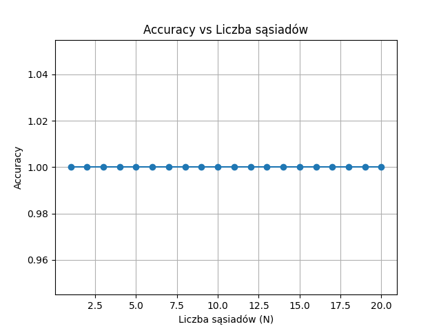
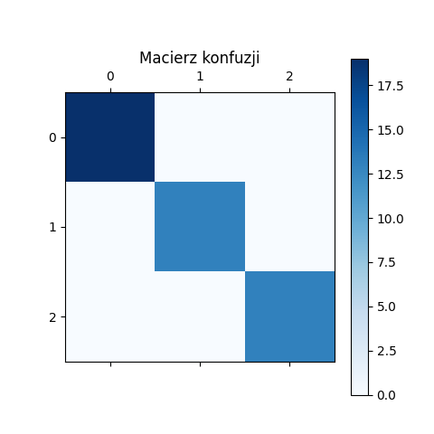
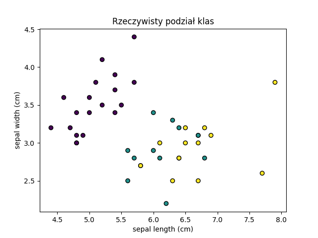
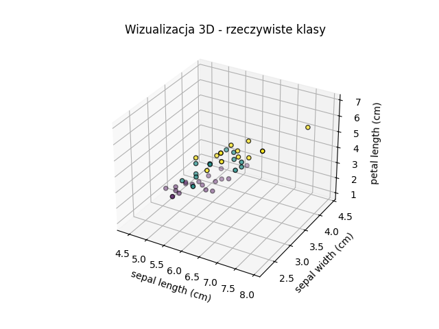
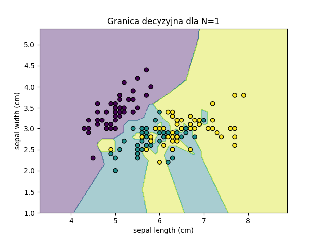

# Lab03 — Klasyfikacja zbioru Iris  
Tomasz Królikowski  
nr albumu: 153790

---

## 1. Opis zadania

Celem zadania była klasyfikacja zbioru danych Iris przy użyciu algorytmu K-Nearest Neighbors (KNN) z wykorzystaniem bibliotek Python:  
- numpy  
- matplotlib  
- pandas  
- scikit-learn  

Wszystkie wyniki zostały automatycznie zapisane do katalogu `wyniki/`.

---

## 2. Zbiór danych Iris

150 próbek, 4 cechy:  
- sepal length  
- sepal width  
- petal length  
- petal width  

Podział danych:  
- 70% trening  
- 30% test  

---

## 3. Dobór liczby sąsiadów (N)

### Wykres: Accuracy vs Liczba Sąsiadów (N)

Najlepsza liczba sąsiadów to: 1

---

## 4. Macierz konfuzji

### Tabela wyników:  

Załączony plik: `wyniki/confusion_matrix.xlsx`

### Wykres:

---

## 5. Wizualizacja podziału klas

### Rzeczywisty podział klas:

### Predykcja modelu KNN:

### Wizualizacja 3D:

---

## 6. Granica decyzyjna

Wizualizacja granicy decyzyjnej modelu KNN dla N=1

---

## 7. Wnioski

- Najlepsza liczba sąsiadów to 1.  
- Model uzyskał wysoką skuteczność klasyfikacji.  
- Wyniki i wykresy jasno pokazują skuteczność algorytmu.  
- Wizualizacje potwierdzają prawidłowy podział klas.

---

## 8. Załączniki

Wszystkie wyniki i wykresy znajdują się w katalogu `wyniki/`.

- Plik z dokładnościami: `accuracy_scores.xlsx`  
- Plik z macierzą konfuzji: `confusion_matrix.xlsx`  
- Wykresy `.png`  
